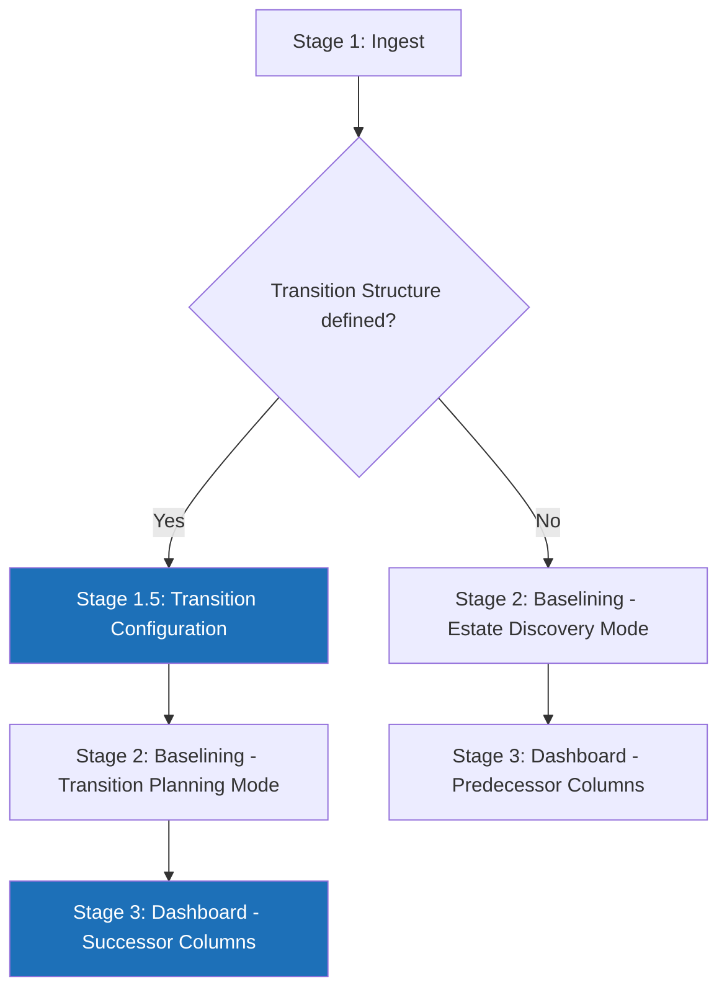
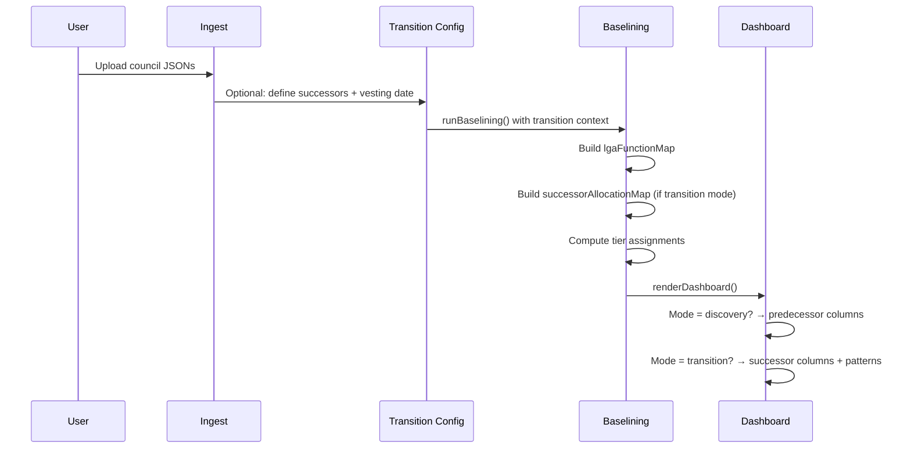
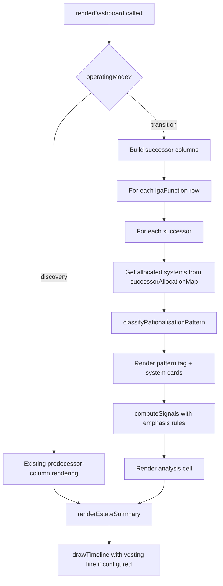

# Design Document: LGR Transition Planning

## Overview

This design transforms the LGR Transition Workspace Engine from an estate discovery register into an analytical transition planning tool. The core change is introducing a **dual-mode architecture**: the existing Estate Discovery mode (predecessor columns) is preserved, and a new Transition Planning mode (successor columns) is activated when a transition structure is configured.

The design addresses 11 requirements across four themes:

1. **Structural awareness** (Requirements 1, 4, 7, 10): The engine learns about successor authorities, vesting dates, and predecessor-to-successor mappings, enabling it to classify rationalisation patterns per function × successor cell.
2. **Temporal anchoring** (Requirements 2, 3): Contract urgency recalculates against the vesting date, and the matrix sorts by playbook-aligned statutory criticality tiers rather than alphabetically.
3. **Cross-cutting signals** (Requirements 5, 6, 9): New signals — TCoP alignment, shared service detection, and financial distress — join the existing signal system with configurable per-persona weights.
4. **Aggregate visibility** (Requirements 8, 11): An estate summary panel and HTML export give programme boards the "how big is this problem?" answer and governance-ready output.

All changes are implemented within the single-file constraint (`lgr-rationalisation-engine.html`), using vanilla JavaScript and the existing module-level state pattern. No new external dependencies are introduced.

### Design Principles

- **Progressive disclosure**: The tool works with minimal data. Every new schema field is optional. The tool degrades gracefully — showing what it can with what it's given, flagging what's missing.
- **Neutral posture**: Signals remain factual observations framed in Playbook and TCoP language. The tool surfaces implications without prescribing decisions.
- **Single-file constraint**: All changes live in `lgr-rationalisation-engine.html`. No build system, no modules, no server.
- **Backward compatibility**: Existing JSON files continue to work unchanged. Estate Discovery mode is the default.

## Architecture

### Dual-Mode Pipeline

The existing three-stage pipeline (Upload → Baseline → Dashboard) is extended with an optional Stage 1.5 (Transition Configuration) that activates Transition Planning mode:



### State Management Changes

The existing module-level state variables are extended, not replaced:

```javascript
// Existing state (unchanged)
let rawUploads = [];
let mergedArchitecture = { nodes: [], edges: [], councils: new Set() };
let activePersona = 'executive';
let activePerspective = 'all';
let lgaFunctionMap = new Map();
let signalWeights;

// New state for transition planning
let transitionStructure = null;       // { vestingDate, successors[] } or null
let operatingMode = 'discovery';      // 'discovery' | 'transition'
let successorAllocationMap = null;    // Map<councilName, { successor, allocation }> or null
let tierMap = new Map();              // Map<lgaFunctionId, 1|2|3> — playbook tier per function
```

The `operatingMode` is derived: if `transitionStructure` is non-null and has at least one successor, mode is `'transition'`; otherwise `'discovery'`. This is a computed value, not independently settable.

### Pipeline Flow



## Components and Interfaces

### 1. Transition Configuration UI (Stage 1.5)

**Location**: New panel rendered between Stage 1 (Ingest) and Stage 2 (Baselining), shown only after files are uploaded.

**Responsibilities**:
- Accept vesting date via a date input
- Accept successor authority definitions: name, full predecessors (checkboxes from uploaded council names), partial predecessors (checkboxes)
- Validate that every uploaded council is assigned to at least one successor (warn if not, don't block)
- Store result in `transitionStructure`
- Allow skipping (proceed in Estate Discovery mode)
- Allow editing after initial configuration (re-renders dashboard without re-uploading)

**Interface**:
```javascript
// transitionStructure shape
{
  vestingDate: "2028-04-01",          // ISO date string
  successors: [
    {
      name: "North East Essex",
      fullPredecessors: ["Braintree DC", "Colchester BC"],
      partialPredecessors: ["Essex CC"]
    }
  ]
}
```

**UI pattern**: A form section with an "Add Successor" button. Each successor gets a name text input and two multi-select checkbox groups (full/partial) populated from `mergedArchitecture.councils`. A "Skip — use Estate Discovery mode" link bypasses the step. A "Reconfigure Transition" button in the Stage 3 header re-opens this panel.

### 2. Extended Baselining (`runBaselining()`)

**Changes to existing function**:

1. **Read new optional fields**: For each ITSystem node, read `annualCost`, `owner`, `sharedWith`, `targetAuthorities` if present. For council-level metadata, read `tier` and `financialDistress` from a new top-level `councilMetadata` object in the JSON.
2. **Build `successorAllocationMap`**: If `transitionStructure` is defined, build a map from each council name to its successor(s) and allocation type (full/partial). Systems from full predecessors are assigned directly. Systems from partial predecessors are flagged for allocation review unless they have a `targetAuthorities` override.
3. **Compute tier assignments**: Load the embedded `DEFAULT_TIER_MAP` (ESD ID → tier). Override with any `tier` field on Function nodes. Apply the Tier 2 promotion rule: if a Tier 3 function has a system with a notice trigger before vesting, promote to Tier 2.

**New council-level metadata schema** (top-level in JSON, alongside `councilName`, `nodes`, `edges`):
```javascript
// Optional council-level metadata
{
  "councilName": "Thurrock BC",
  "councilMetadata": {
    "tier": "unitary",              // "county" | "district" | "unitary"
    "financialDistress": true       // boolean
  },
  "nodes": [...],
  "edges": [...]
}
```

### 3. Successor Allocation Engine

**New function**: `buildSuccessorAllocation()`

Computes which systems appear in which successor columns. The logic:

1. For each system in `mergedArchitecture.nodes` where `type === 'ITSystem'`:
   - If the system has `targetAuthorities` array → assign to each listed successor
   - Else if the system's `_sourceCouncil` is a `fullPredecessor` of a successor → assign to that successor
   - Else if the system's `_sourceCouncil` is a `partialPredecessor` → assign to ALL successors that list this council as partial, with a `needsAllocationReview: true` flag
   - Else → unallocated (warn in UI)

2. Returns a `Map<successorName, Map<lgaFunctionId, SystemAllocation[]>>` where each `SystemAllocation` is:
```javascript
{
  system: { ...systemNode },
  sourceCouncil: "Essex CC",
  allocationType: "full" | "partial" | "targeted",
  needsAllocationReview: boolean,
  isDisaggregation: boolean  // true if system appears in multiple successors
}
```

### 4. Rationalisation Pattern Classifier

**New function**: `classifyRationalisationPattern(allocations)`

For each function × successor cell, examines the `SystemAllocation[]` array and returns one of:

| Pattern | Condition | Colour |
|---|---|---|
| `inherit-as-is` | Exactly 1 system, no disaggregation | `tag-green` |
| `choose-and-consolidate` | 2+ systems, none from partial predecessors | `tag-blue` |
| `extract-and-partition` | 1+ systems from partial predecessor requiring disaggregation, no competing systems from other predecessors | `tag-red` |
| `extract-partition-and-consolidate` | 1+ systems from partial predecessor requiring disaggregation AND 1+ competing systems from other predecessors | `tag-purple` |

The pattern determines which signals are emphasised in that cell (see Signal Emphasis Rules below).

### 5. Vesting-Anchored Contract Analysis

**Changes to `computeSignals()`**:

The contract urgency signal computation branches on whether `transitionStructure?.vestingDate` is set:

- **With vesting date**: Compute notice trigger month. Classify into zones:
  - `pre-vesting`: trigger < vesting date → `tag-red`, strong
  - `year-1`: trigger within 12 months after vesting → `tag-orange`, strong
  - `natural-expiry`: trigger 1–3 years after vesting → `tag-blue`
  - `long-tail`: trigger 3+ years after vesting → grey, low priority
  
  Signal value text includes the zone label and the relationship to vesting: "Notice trigger 6 months before vesting — predecessor must serve notice."

- **Without vesting date**: Fall back to current today-relative calculation (unchanged).

**Changes to `drawTimeline()`**:

- When `transitionStructure?.vestingDate` is set, the timeline centres on the vesting date rather than using the fixed 2024–2030 range. A vertical red dashed line marks vesting day. The date range is computed as `vestingDate - 2 years` to `vestingDate + 4 years`.
- When no vesting date is set, the current fixed 2024–2030 range is preserved.

### 6. Playbook Tier System

**New constant**: `DEFAULT_TIER_MAP`

An embedded mapping of all 176 ESD function IDs to playbook tiers. The classification follows the MHCLG Playbook's prioritisation guidance:

- **Tier 1 (Day 1 critical)**: Adult social care (148), children's social care (152), revenues/benefits (3), housing benefit (124), elections/democratic services (146), payroll/HR (119), finance (116), fire safety (19, 130, 131), public health (65), homelessness (68), waste collection (142), environmental health (34)
- **Tier 2 (High priority)**: Highways (109, 171), planning/building control (99, 100, 101, 103), housing (66, 67, 68, 69), public transport (111), registration (54), community safety (16), trading standards (15)
- **Tier 3 (Post-Day 1)**: Libraries (76), leisure (72, 75), arts (73), tourism (81), museums (78), sports (80), parks (36), events (74), religion/culture (79)

Functions not explicitly mapped default to Tier 2.

**Tier promotion rule**: When a vesting date is configured and a Tier 3 function has any system with a notice trigger falling before vesting, that function is promoted to Tier 2 for sorting purposes. The original tier is preserved in the display (shown as "Tier 3 → promoted to Tier 2").

**Visibility**: A "View Tier Mapping" button in the dashboard header opens a reference modal showing the full ESD-to-tier mapping, allowing practitioners to inspect and challenge the defaults.

### 7. TCoP Alignment Signal

**New signal added to `SIGNAL_DEFS`**:

```javascript
{ id: 'tcopAlignment', label: 'TCoP alignment', desc: 'Assessment against Technology Code of Practice criteria' }
```

**Computation in `computeSignals()`**:

For each system, assess against four TCoP points:
- Point 5 (Cloud first): `isCloud === true` → aligned; `false` → concern
- Point 4 (Open standards): `portability === "High"` → aligned; `"Low"` → concern
- Points 3, 4, 11 (Vendor lock-in): `portability === "Low"` → concern
- Point 9 (Modular components): `isERP === true && dataPartitioning === "Monolithic"` → concern

Output format: List of concerns and alignments per system, followed by the standard framing: "These are factors to consider alongside operational, commercial, and service-specific requirements."

**Per-persona defaults**:
```javascript
// Added to PERSONA_DEFAULT_WEIGHTS
executive:  { ..., tcopAlignment: 1 },
commercial: { ..., tcopAlignment: 0 },
architect:  { ..., tcopAlignment: 3 }
```

### 8. Shared Service Signal

**New signal added to `SIGNAL_DEFS`**:

```javascript
{ id: 'sharedService', label: 'Shared service', desc: 'Systems jointly operated by multiple predecessor councils' }
```

**Computation in `computeSignals()`**:

For each system with a `sharedWith` array:
- In Estate Discovery mode: note which councils share the system
- In Transition Planning mode: resolve each sharing council to its successor. If councils map to different successors → "Shared service unwinding required — review contract ownership, data partition, and hosting arrangements." If same successor → "Shared service continues within the same successor."

**Per-persona defaults**:
```javascript
executive:  { ..., sharedService: 2 },
commercial: { ..., sharedService: 3 },
architect:  { ..., sharedService: 1 }
```

### 9. Signal Emphasis Rules

In Transition Planning mode, the rationalisation pattern of a cell determines which signals are emphasised (rendered at +1 weight, capped at 3):

| Pattern | Emphasised signals |
|---|---|
| `extract-and-partition` | dataMonolith, dataPortability |
| `extract-partition-and-consolidate` | dataMonolith, dataPortability, vendorDensity |
| `choose-and-consolidate` | userVolume, vendorDensity, tcopAlignment |
| `inherit-as-is` | No emphasis changes |

This is a display-time adjustment only — it does not modify the user's configured weights.

### 10. Estate Summary Panel

**New function**: `renderEstateSummary()`

Renders a summary panel above the matrix in Stage 3. The panel has two sections:

**Estate Overview** (always shown):
- Total predecessor councils: `mergedArchitecture.councils.size`
- Total systems: count of ITSystem nodes
- Functions with cross-council collisions: count from `lgaFunctionMap`
- Total annual IT spend: sum of `annualCost` across all systems (shown only if any system has `annualCost`)

**Transition Risk** (shown only in Transition Planning mode):
- Successor authorities: count from `transitionStructure.successors`
- Vesting date: from `transitionStructure.vestingDate`
- Contracts with notice trigger before vesting: count
- Systems requiring disaggregation: count of systems appearing in 2+ successor columns
- Monolithic data + disaggregation: count of systems with `dataPartitioning === "Monolithic"` AND disaggregation flag
- Shared services crossing successor boundaries: count

### 11. Financial Distress Flag

**Implementation**: During `runBaselining()`, if a council's `councilMetadata.financialDistress === true`:
- Store the council name in a `Set` called `distressedCouncils`
- In `buildSystemCard()`: if `sys._sourceCouncil` is in `distressedCouncils`, render a warning banner: "⚠ Predecessor in financial distress — verify system currency, support status, and licence compliance."
- In the matrix column header: append a warning icon and tooltip for distressed councils

### 12. Council Tier Display

**Implementation**: During `runBaselining()`, if a council's `councilMetadata.tier` is set:
- Store in a `Map<councilName, tier>` called `councilTierMap`
- In `buildSystemCard()`: display a small tier badge (e.g., "COUNTY", "DISTRICT", "UNITARY")
- In the matrix column header: append the tier label
- In collision rows where systems originate from different tiers: add an annotation "⚠ Cross-tier: county and district functions may represent complementary delivery, not duplication"

### 13. Transition Planning Matrix Rendering

**Changes to `renderDashboard()`**:

In Transition Planning mode, the matrix structure changes:

- **Columns**: One per successor authority (from `transitionStructure.successors`), plus the Analysis column. The Perspective dropdown switches to successor names instead of predecessor names.
- **Rows**: Sorted by tier first, then collision count within tier, then alphabetically. Each row header shows the tier badge alongside the ESD label.
- **Cells**: Each cell shows the systems allocated to that successor for that function, with the rationalisation pattern tag at the top. System cards include provenance (which predecessor the system came from).
- **Analysis column**: Signals are computed per-successor-cell, with emphasis rules applied based on the rationalisation pattern.

In Estate Discovery mode, the existing rendering is preserved with two additions:
- Rows are sorted by tier (if tier data is available) instead of purely by collision count
- The estate summary panel is shown above the matrix

### 14. Export Function

**New function**: `exportToHTML()`

Generates a standalone HTML document containing:
- The estate summary panel
- The current matrix (respecting active persona, perspective, signal weights)
- The contract timeline (if visible for the current persona)
- Metadata header: active persona, signal weight configuration, transition structure (if defined), export timestamp

The export uses `window.open()` to create a new window with the generated HTML, which the user can then print or save. The generated HTML includes inline styles (no CDN dependency) for offline use.

### 15. Dashboard Rendering Flow (Transition Planning Mode)



## Data Models

### Extended ITSystem Node Schema

All new fields are optional. Existing fields are unchanged.

```javascript
{
  // Existing required fields
  id: "sys-001",
  label: "Liquidlogic ASC",
  type: "ITSystem",
  
  // Existing optional fields (unchanged)
  vendor: "System C",
  users: 3500,
  cost: "£950k/yr",           // Display string (unchanged)
  endYear: 2028,
  endMonth: 3,
  noticePeriod: 12,
  portability: "Medium",       // "High" | "Medium" | "Low"
  dataPartitioning: "Segmented", // "Segmented" | "Monolithic"
  isCloud: true,
  isERP: false,
  
  // New optional fields
  annualCost: 950000,          // Numeric, for computation (£)
  owner: "Council A",          // Who operates it — council name or outsourcer
  sharedWith: ["Southby BC"],  // Array of council names sharing this system
  targetAuthorities: ["Unitary AB", "Unitary C"]  // Override successor allocation
}
```

### Extended Council JSON Schema

```javascript
{
  "councilName": "Thurrock BC",
  
  // New optional top-level object
  "councilMetadata": {
    "tier": "unitary",           // "county" | "district" | "unitary"
    "financialDistress": true    // boolean
  },
  
  "nodes": [...],
  "edges": [...]
}
```

### Transition Structure Schema

Separate from council data. Configured in-tool via the Stage 1.5 UI.

```javascript
{
  "vestingDate": "2028-04-01",
  "successors": [
    {
      "name": "North East Essex",
      "fullPredecessors": ["Braintree DC", "Colchester BC", "Tendring DC"],
      "partialPredecessors": ["Essex CC"]
    },
    {
      "name": "South East Essex",
      "fullPredecessors": ["Basildon BC", "Castle Point BC"],
      "partialPredecessors": ["Essex CC"]
    }
  ]
}
```

### Internal Data Structures

```javascript
// Successor allocation result (internal, not persisted)
// Map<successorName, Map<lgaFunctionId, SystemAllocation[]>>
SystemAllocation = {
  system: { ...ITSystemNode },
  sourceCouncil: string,
  allocationType: "full" | "partial" | "targeted",
  needsAllocationReview: boolean,
  isDisaggregation: boolean
}

// Rationalisation pattern (computed per cell)
RationalisationPattern = "inherit-as-is" | "choose-and-consolidate" | "extract-and-partition" | "extract-partition-and-consolidate"

// Tier assignment (computed during baselining)
// Map<lgaFunctionId, { tier: 1|2|3, promoted: boolean, originalTier: 1|2|3 }>
```

### Signal System Extensions

```javascript
// Extended SIGNAL_DEFS (2 new signals added)
const SIGNAL_DEFS = [
  // Existing 6 signals unchanged
  { id: 'contractUrgency', ... },
  { id: 'userVolume', ... },
  { id: 'dataMonolith', ... },
  { id: 'dataPortability', ... },
  { id: 'vendorDensity', ... },
  { id: 'techDebt', ... },
  // New signals
  { id: 'tcopAlignment', label: 'TCoP alignment', desc: 'Assessment against Technology Code of Practice criteria' },
  { id: 'sharedService', label: 'Shared service', desc: 'Systems jointly operated by multiple predecessor councils' }
];

// Extended per-persona defaults
const PERSONA_DEFAULT_WEIGHTS = {
  executive:  { contractUrgency: 3, userVolume: 2, dataMonolith: 3, dataPortability: 1, vendorDensity: 2, techDebt: 1, tcopAlignment: 1, sharedService: 2 },
  commercial: { contractUrgency: 3, userVolume: 1, dataMonolith: 1, dataPortability: 0, vendorDensity: 3, techDebt: 0, tcopAlignment: 0, sharedService: 3 },
  architect:  { contractUrgency: 1, userVolume: 2, dataMonolith: 3, dataPortability: 3, vendorDensity: 1, techDebt: 3, tcopAlignment: 3, sharedService: 1 }
};
```


## Correctness Properties

*A property is a characteristic or behavior that should hold true across all valid executions of a system — essentially, a formal statement about what the system should do. Properties serve as the bridge between human-readable specifications and machine-verifiable correctness guarantees.*

### Property 1: Successor allocation correctness

*For any* estate with a transition structure, and *for any* ITSystem node:
- If the system's source council is a full predecessor of a successor and the system has no `targetAuthorities`, the system SHALL appear in exactly that successor's column with `allocationType: "full"` and `needsAllocationReview: false`.
- If the system's source council is a partial predecessor and the system has no `targetAuthorities`, the system SHALL appear in every successor that lists the council as partial, with `needsAllocationReview: true` and `isDisaggregation: true` when appearing in 2+ successors.
- If the system has a `targetAuthorities` array, the system SHALL appear in exactly the successors listed in that array, with `allocationType: "targeted"`, regardless of the predecessor's full/partial status. When `targetAuthorities` lists 2+ successors, `isDisaggregation` SHALL be `true`.

**Validates: Requirements 1.4, 1.5, 1.6, 1.7, 7.1, 7.4**

### Property 2: Vesting-anchored zone classification

*For any* system with `endYear` and `noticePeriod`, and *for any* vesting date, the computed notice trigger month (`endYear * 12 + endMonth - noticePeriod`) relative to the vesting month SHALL classify into exactly one zone:
- `pre-vesting` if notice trigger < vesting month
- `year-1` if notice trigger is within 12 months after vesting month
- `natural-expiry` if notice trigger is 12–36 months after vesting month
- `long-tail` if notice trigger is 36+ months after vesting month

**Validates: Requirements 2.1, 2.3, 2.5**

### Property 3: Tier-based matrix sorting

*For any* set of function rows with tier assignments and collision counts, the sorted order SHALL satisfy: for every adjacent pair (row_i, row_j) where i < j, either `tier_i < tier_j`, or `tier_i === tier_j && collisionCount_i >= collisionCount_j`, or `tier_i === tier_j && collisionCount_i === collisionCount_j && label_i <= label_j`.

**Validates: Requirements 3.2**

### Property 4: Effective tier computation

*For any* function with an ESD ID:
- If the function node has a `tier` field, the effective tier SHALL equal that override value.
- Otherwise, the effective tier SHALL equal the value from `DEFAULT_TIER_MAP` (or Tier 2 if unmapped).
- If the effective tier is 3 AND a vesting date is configured AND any system serving that function has a notice trigger before the vesting date, the effective tier for sorting SHALL be promoted to 2, with the original tier preserved for display.

**Validates: Requirements 3.3, 3.6**

### Property 5: Rationalisation pattern classification

*For any* function × successor cell in Transition Planning mode, given the set of system allocations in that cell:
- If exactly 1 system and `isDisaggregation === false` → pattern SHALL be `inherit-as-is`
- If 2+ systems and none have `allocationType === "partial"` or `isDisaggregation === true` → pattern SHALL be `choose-and-consolidate`
- If 1+ systems have `isDisaggregation === true` AND no other systems from non-partial predecessors → pattern SHALL be `extract-and-partition`
- If 1+ systems have `isDisaggregation === true` AND 1+ other systems from non-partial predecessors → pattern SHALL be `extract-partition-and-consolidate`

**Validates: Requirements 4.1, 4.2, 4.3, 4.4, 4.5**

### Property 6: Signal emphasis matches rationalisation pattern

*For any* cell in Transition Planning mode with a classified rationalisation pattern, the signal emphasis adjustments SHALL match:
- `extract-and-partition` or `extract-partition-and-consolidate` → `dataMonolith` and `dataPortability` weights increased by 1 (capped at 3)
- `choose-and-consolidate` → `userVolume`, `vendorDensity`, and `tcopAlignment` weights increased by 1 (capped at 3)
- `inherit-as-is` → no weight adjustments

**Validates: Requirements 4.7, 4.8**

### Property 7: TCoP assessment correctness

*For any* ITSystem node, the TCoP alignment assessment SHALL produce:
- `isCloud === true` → alignment with Point 5
- `isCloud === false` → concern for Point 5
- `portability === "High"` → alignment with Point 4
- `portability === "Low"` → concern for Points 3, 4, 11
- `isERP === true && dataPartitioning === "Monolithic"` → concern for Point 9
- All other combinations → no additional concerns or alignments for those fields

**Validates: Requirements 5.1, 5.2, 5.3, 5.4, 5.5, 5.6**

### Property 8: Shared service boundary detection

*For any* system with a `sharedWith` array, and *for any* transition structure:
- If all councils in `[system._sourceCouncil, ...system.sharedWith]` map to the same successor → the shared service signal SHALL indicate continuation within the same successor, with no unwinding flag.
- If the councils map to 2+ different successors → the shared service signal SHALL indicate unwinding is required.

**Validates: Requirements 6.3, 6.4**

### Property 9: Estate summary metrics correctness

*For any* estate:
- The total predecessor count SHALL equal `mergedArchitecture.councils.size`
- The total system count SHALL equal the count of nodes where `type === "ITSystem"`
- The collision count SHALL equal the count of `lgaFunctionMap` entries where `councils.size > 1`
- If any system has `annualCost`, the total annual spend SHALL equal the sum of all `annualCost` values
- If a vesting date is configured, the pre-vesting notice trigger count SHALL equal the count of systems where `(endYear * 12 + endMonth - noticePeriod) < vestingMonth`
- In transition mode, the disaggregation count SHALL equal the count of systems with `isDisaggregation === true`
- The monolithic-disaggregation count SHALL equal the count of systems with `isDisaggregation === true && dataPartitioning === "Monolithic"`
- The cross-boundary shared service count SHALL equal the count of shared systems where sharing councils map to different successors

**Validates: Requirements 8.2, 8.3, 8.4, 8.5, 8.6, 8.7**

### Property 10: Financial distress propagation

*For any* estate where a council has `financialDistress: true`, every system where `_sourceCouncil` matches that council SHALL have the financial distress warning applied. No system from a council without `financialDistress: true` SHALL have the warning.

**Validates: Requirements 9.2**

### Property 11: Cross-tier collision annotation

*For any* function row containing systems from 2+ councils, if those councils have different `tier` values (e.g., one is "county" and another is "district"), the row SHALL include a cross-tier annotation. If all contributing councils have the same tier (or no tier data), no cross-tier annotation SHALL appear.

**Validates: Requirements 10.3**

### Property 12: Transition structure round-trip

*For any* valid transition structure (with a vesting date string and an array of successors each having a name, fullPredecessors array, and partialPredecessors array), storing it in `transitionStructure` and reading it back SHALL preserve all fields. Partial structures (successors with empty predecessor arrays) SHALL also be accepted without error.

**Validates: Requirements 1.1, 1.8**

## Error Handling

### Data Validation Errors

| Error condition | Handling |
|---|---|
| Council JSON missing `councilName` | Use filename as fallback (existing behaviour) |
| Function node missing `lgaFunctionId` | Exclude from analysis, report in validation errors (existing behaviour) |
| `annualCost` is not a number | Ignore for computation, use `cost` string for display only |
| `tier` value not in `["county", "district", "unitary"]` | Ignore, treat as unset |
| `targetAuthorities` references a successor not in `transitionStructure` | Display warning: "System X references unknown successor Y — check transition structure" |
| `sharedWith` references a council not in uploaded data | Display the reference as-is (the sharing council may not have uploaded data) |
| Uploaded council not assigned to any successor | Display warning in transition config UI: "Council X is not assigned to any successor" |
| Vesting date is not a valid ISO date | Reject, show validation error, fall back to Estate Discovery mode |

### Graceful Degradation

The tool follows a "show what you can, flag what's missing" principle:

- **No `annualCost` on any system**: Estate summary omits the total spend line
- **No `tier` on any council**: Tier badges are not shown; sorting falls back to collision count → alphabetical
- **No `sharedWith` on any system**: Shared service signal never fires
- **No `financialDistress` on any council**: No distress warnings shown
- **Partial transition structure** (successors named but no predecessors assigned): Show successor columns with "No predecessors assigned" placeholder; systems remain unallocated
- **No transition structure**: Full Estate Discovery mode (current behaviour)

### State Recovery

- The "Start Over" button clears all state including `transitionStructure` and returns to Stage 1
- The "Reconfigure Transition" button preserves `rawUploads` and `mergedArchitecture` but allows editing `transitionStructure`, then re-runs `renderDashboard()`
- Persona and perspective changes never require re-baselining

## Testing Strategy

### Testing Approach

This feature uses a dual testing approach:

1. **Property-based tests** verify universal correctness properties across randomly generated inputs — the 12 properties defined above.
2. **Example-based unit tests** verify specific scenarios, edge cases, and UI rendering behaviour.

Since the application is a single HTML file with vanilla JavaScript, tests will be written using a test runner that can execute the pure logic functions extracted from the application. The key testable functions are pure computations that can be tested independently of the DOM.

### Property-Based Testing

**Library**: [fast-check](https://github.com/dubzzz/fast-check) — the standard PBT library for JavaScript.

**Configuration**: Each property test runs a minimum of 100 iterations.

**Tag format**: Each test is tagged with `Feature: lgr-transition-planning, Property {N}: {title}`.

**Testable pure functions** (extracted or callable without DOM):
- `buildSuccessorAllocation()` — Properties 1, 12
- `classifyVestingZone()` — Property 2
- `sortFunctionRows()` — Property 3
- `computeEffectiveTier()` — Property 4
- `classifyRationalisationPattern()` — Property 5
- `computeSignalEmphasis()` — Property 6
- `computeTcopAssessment()` — Property 7
- `detectSharedServiceBoundary()` — Property 8
- `computeEstateSummaryMetrics()` — Property 9
- `propagateFinancialDistress()` — Property 10
- `detectCrossTierCollision()` — Property 11

**Generator strategy**: Custom generators for:
- `arbITSystem`: random system with optional fields (vendor, users, annualCost, endYear, endMonth, noticePeriod, portability, dataPartitioning, isCloud, isERP, owner, sharedWith, targetAuthorities)
- `arbCouncil`: random council with nodes, edges, and optional councilMetadata
- `arbTransitionStructure`: random structure with vesting date, successors, full/partial predecessors drawn from a generated council set
- `arbEstate`: combines multiple `arbCouncil` instances with an optional `arbTransitionStructure`

### Example-Based Unit Tests

| Test area | Examples |
|---|---|
| Mode switching | No structure → discovery mode; valid structure → transition mode |
| Vesting date fallback | No vesting date → today-relative urgency; with vesting date → zone-based |
| Tier mapping reference | DEFAULT_TIER_MAP contains all expected Tier 1 functions (148, 152, 3, etc.) |
| Export content | Export HTML contains persona name, signal weights, matrix content |
| UI rendering | Tier badge appears in row header; pattern tag appears in cell; distress warning appears on card |
| Transition config UI | Add successor, assign predecessors, skip to discovery mode |
| Timeline vesting line | Vesting date marker appears in timeline DOM |

### Integration Tests

| Scenario | What it validates |
|---|---|
| Essex 15→5 scenario | County partial predecessor disaggregation across 5 successors; Thurrock financial distress flag; cross-tier collisions between county and district functions |
| Norfolk parish split | Partial predecessor with targetAuthorities overrides; segmented vs monolithic data partitioning flags |
| Hampshire unitary absorption | Existing unitary (Portsmouth) as full predecessor; extract-partition-and-consolidate pattern for social care |
| Shared NEC Revenues | sharedWith detection; cross-successor boundary unwinding flag |

### Test File Structure

```
tests/
  generators/
    arbITSystem.js
    arbCouncil.js
    arbTransitionStructure.js
    arbEstate.js
  properties/
    successor-allocation.property.test.js
    vesting-zones.property.test.js
    tier-sorting.property.test.js
    effective-tier.property.test.js
    rationalisation-pattern.property.test.js
    signal-emphasis.property.test.js
    tcop-assessment.property.test.js
    shared-service-boundary.property.test.js
    estate-summary.property.test.js
    financial-distress.property.test.js
    cross-tier-annotation.property.test.js
    transition-structure-roundtrip.property.test.js
  unit/
    mode-switching.test.js
    vesting-fallback.test.js
    tier-mapping.test.js
    export.test.js
  integration/
    essex-scenario.test.js
    norfolk-scenario.test.js
    hampshire-scenario.test.js
    shared-service-scenario.test.js
```
