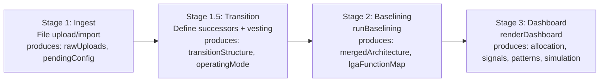
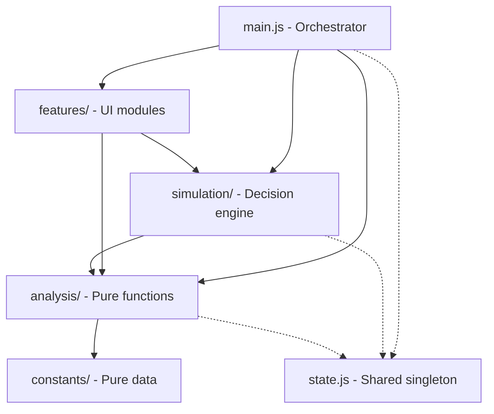

# Module Architecture

The LGR Rationalisation Engine is a modular ES module application bundled by esbuild into a single self-contained HTML file. This page covers module organisation, state management, data flow, and key data structures.

## Module Organisation

```
src/
├── index.html                  # HTML template with {{STYLES}} and {{BUNDLE}} placeholders
├── styles.css                  # CSS custom properties (GDS palette) and component styles
├── main.js                     # Entry point: UI rendering, event wiring, pipeline orchestration (~2600 lines)
├── state.js                    # Central state singleton (exported mutable object)
├── taxonomy.js                 # ESD function taxonomy lookups (getLgaFunction, getLgaBreadcrumb, etc.)
├── ui-helpers.js               # escHtml, wrapWithTooltip, helpIcon, tagToSignalDotClass
├── ui-notifications.js         # Toast notification system (showNotification, showConfirm)
├── constants/                  # Static data - never mutated at runtime
│   ├── lga-functions.js        #   176-entry ESD taxonomy: { id, label, parentId }
│   ├── tier-map.js             #   DEFAULT_TIER_MAP: Map<lgaFunctionId, 1|2|3>
│   ├── signals.js              #   SIGNAL_DEFS array + PERSONA_DEFAULT_WEIGHTS object
│   ├── capabilities.js         #   LGAM_CAPABILITIES vocabulary
│   ├── domain-terms.js         #   Rich tooltip definitions for domain terminology
│   ├── documentation.js        #   Structured content for help modals
│   └── schema-definitions.js   #   Schema definitions used by build for JSON Schema generation
├── analysis/                   # Pure analysis functions (no side effects)
│   ├── allocation.js           #   buildSuccessorAllocation, classifyVestingZone, boundary detection
│   ├── signals.js              #   computeSignals, computeSignalEmphasis, computeTcopAssessment
│   ├── metrics.js              #   computeEstateSummaryMetrics, computeEffectiveTier, sortFunctionRows
│   ├── hosting.js              #   getHostingType, isNonCloud, isCloud, detectHostingRisk
│   └── questions.js            #   generatePersonaQuestions
├── simulation/                 # Decision simulation engine
│   ├── actions.js              #   applyAllActions - applies action array to baseline nodes/edges
│   ├── decisions.js            #   FunctionDecision model, createDecision, getDecisionKey
│   ├── projector.js            #   projectDecisions - translates decisions into legacy actions
│   ├── obligations.js          #   generateObligations, generateDisaggregationObligations, etc.
│   └── impact.js              #   Impact scoring and severity computation
└── features/                   # Feature modules (UI + logic for distinct tools)
    ├── unified-editor/         #   Three-pane architecture editor (see editor-internals page)
    │   ├── editor.js           #     Orchestrator: render + wire + state management
    │   ├── list-panel.js       #     Left pane: domain-grouped system list
    │   ├── props-panel.js      #     Centre pane: property editor for selected node
    │   ├── rel-panel.js        #     Right pane: relationships and capabilities
    │   ├── bulk-mode.js        #     Full-width tabular editing mode
    │   ├── dep-matrix.js       #     Dependency heatmap (CONSUMES_CAPABILITY edges)
    │   ├── smart-inputs.js     #     Shared input utilities (formatThousands, chips, radio groups)
    │   └── wizard.js           #     Step-by-step onboarding for "Build from Scratch"
    ├── decision-panel.js       #   Decision UI: radio buttons, blast radius, cross-successor
    ├── simulation-panel.js     #   Side panel: decision list, progress, undo, metrics
    ├── import-wizard.js        #   Multi-format import (CSV, Excel, clipboard, manual)
    ├── baseline-report.js      #   Pre-simulation estate report (persona-tailored)
    ├── report-export.js        #   Formatted report export per persona
    ├── scenario-manager.js     #   Save/load/export decision scenarios
    ├── sankey-diagram.js       #   Sankey flow overlay (D3-based)
    ├── domain-cards.js         #   Hierarchical matrix: domain summaries and cards
    ├── template-generator.js   #   Excel template download
    ├── template-converter.js   #   XLSX-to-architecture JSON converter
    ├── schema-reference.js     #   In-app schema documentation
    ├── validation-panel.js     #   Architecture validation and completeness checks
    └── pre-import-editor.js    #   Transition config editor (pre-import stage)
```

## Entry Point and Bundling

`src/main.js` is the sole entry point for esbuild. It imports everything the app needs:

```javascript
// main.js - first lines show the import graph
import { LGA_FUNCTIONS } from './constants/lga-functions.js';
import { DEFAULT_TIER_MAP } from './constants/tier-map.js';
import { SIGNAL_DEFS, PERSONA_DEFAULT_WEIGHTS } from './constants/signals.js';
import { buildSuccessorAllocation, classifyVestingZone, ... } from './analysis/allocation.js';
import { computeSignals, computeSignalEmphasis, ... } from './analysis/signals.js';
import { state } from './state.js';
import { renderUnifiedEditor, wireUnifiedEditor } from './features/unified-editor/editor.js';
// ... ~30 more imports
```

esbuild resolves the full dependency tree from `main.js`, bundles it as a single IIFE, and the build script injects it into `src/index.html` at the `{{BUNDLE}}` placeholder. The result is a single `.html` file that runs anywhere.

**To add a new module:** create the file in the appropriate directory, `export` your functions, and `import` them from `main.js` (or from another module that `main.js` already imports). esbuild handles the rest.

## State Management

All mutable application state lives in a single exported object in `src/state.js`:

```javascript
export const state = {
    // --- Core workspace ---
    rawUploads: [],                          // Parsed council JSON payloads
    mergedArchitecture: { nodes: [], edges: [], councils: new Set() },
    lgaFunctionMap: new Map(),               // lgaFunctionId -> { lgaId, label, breadcrumb, councils, localNodeIds }

    // --- Transition planning ---
    transitionStructure: null,               // { vestingDate, successors[] } or null
    operatingMode: 'discovery',              // 'discovery' | 'transition'
    successorAllocationMap: null,            // Map<successorName, Map<lgaFunctionId, SystemAllocation[]>>
    pendingTransitionConfig: null,           // Auto-detected transition config from upload

    // --- Analysis ---
    activePersona: 'executive',             // 'executive' | 'commercial' | 'architect'
    activePerspective: 'all',               // 'all' | specific name
    signalWeights: null,                    // Cloned from PERSONA_DEFAULT_WEIGHTS on init

    // --- Simulation ---
    simulationState: null,                  // { decisions: Map, actions: [], obligations: [], ... }

    // --- Capability graph ---
    capabilityDependencies: new Map(),      // consumerId -> Set<providerId>
    capabilityProviders: new Map(),         // providerId -> Map<consumerId, capabilities[]>

    // --- UI state ---
    activeTab: 'matrix',                    // 'matrix' | 'overview' | 'timeline'
    matrixViewMode: 'hierarchy',            // 'hierarchy' | 'flat'
    cardCollapseState: 'collapsed',         // Global default for system cards
    expandedCards: new Set(),               // Individual overrides
    // ... sort, filter, and panel states
};
```

State mutations happen directly (e.g., `state.operatingMode = 'transition'`). There is no reducer pattern - the pipeline is one-directional so this remains manageable.

## Data Flow: The 4-Stage Pipeline



Each stage's output becomes the next stage's input. The "Start Over" button clears all state back to Stage 1.

## Key Data Structures

### SystemAllocation

Returned by `buildSuccessorAllocation()`. Represents one system's assignment to a successor for a specific function:

```javascript
{
    system: { ...ITSystemNode },     // Full node object (access via a.system.id, a.system.vendor)
    sourceCouncil: "Essex County",   // Council that owns this system
    allocationType: "full",          // "full" | "partial" | "explicit"
    needsAllocationReview: false,    // True if allocation is ambiguous
    isDisaggregation: false          // True if this system maps to 2+ successors
}
```

**Important:** The system object is nested under `a.system`, not flattened.

### lgaFunctionMap

Built during Stage 2 baselining. Keyed by ESD function ID:

```javascript
Map<string, {
    lgaId: string,          // Same as key
    label: string,          // "Adult Social Care"
    breadcrumb: string|null,// "Health & Social Care > Adult Social Care" (or null for top-level)
    councils: Set<string>,  // Set of council names that have this function
    localNodeIds: Set<string>  // Set of Function node IDs across all uploads
}>
```

### editorState (Unified Editor)

A deep clone of a council's architecture JSON, held locally within the editor closure:

```javascript
{
    nodes: [...],               // Array of Function and ITSystem node objects
    edges: [...],               // Array of edge objects
    councilName: "...",
    councilMetadata: { tier, financialDistress },
    _bulkActiveTab: 'contract', // Internal editor UI state
    _bulkFilters: {},
    _bulkSort: null
}
```

### FunctionDecision (Simulation)

The user-facing decision model (see [Simulation Engine](simulation-engine.html)):

```javascript
{
    id: "dec-148-north-essex-1714000000000",
    functionId: "148",
    successorName: "North Essex Unitary",
    systemChoice: "choose",         // 'choose' | 'procure' | 'defer'
    retainedSystemIds: ["sys-1"],
    boundaryChoice: "none",         // 'none' | 'disaggregate' | 'maintain-shared' | 'establish-shared'
    // ... additional fields per choice type
}
```

## External Dependencies

| Dependency | Load Method | Purpose |
|---|---|---|
| Tailwind CSS | CDN (`<script>` in index.html) | Utility-class styling |
| PapaParse | Lazy-loaded from CDN | CSV parsing in import wizard |
| SheetJS (xlsx) | Lazy-loaded from CDN | Excel file reading/writing |
| D3.js | Lazy-loaded from CDN | Sankey diagram rendering |

All external dependencies are loaded from CDN at runtime. The bundled JavaScript has zero npm runtime dependencies - only build tools (esbuild, vitest, fast-check) are in `node_modules`.

## Module Dependency Graph

The import structure follows a strict hierarchy to avoid circular dependencies:



Each layer imports only from layers below it. Solid arrows show the primary dependency direction. Dashed arrows show state access (read for context, never mutated by analysis/simulation).

**Key rule:** `analysis/` functions are pure - they accept data as arguments and return results. They read `state` only for context (e.g., `state.transitionStructure?.vestingDate`) but never mutate it. Mutation happens in `main.js` event handlers.

## How to Add a New Feature Module

1. Create `src/features/my-feature.js` (or a directory for multi-file features)
2. Export your render and wire functions:
   ```javascript
   export function renderMyFeature(data) { return '<div>...</div>'; }
   export function wireMyFeature(container, callbacks) { /* attach listeners */ }
   ```
3. Import in `src/main.js`:
   ```javascript
   import { renderMyFeature, wireMyFeature } from './features/my-feature.js';
   ```
4. Call your render function at the appropriate pipeline stage
5. Run `node build.js` to verify the bundle compiles

## How to Add a New Analysis Function

1. Create or extend a file in `src/analysis/`
2. Keep it pure - accept data as arguments, return results, no DOM access
3. Import from `main.js` to wire into the pipeline
4. Write property tests in `tests/properties/` using the existing generators
