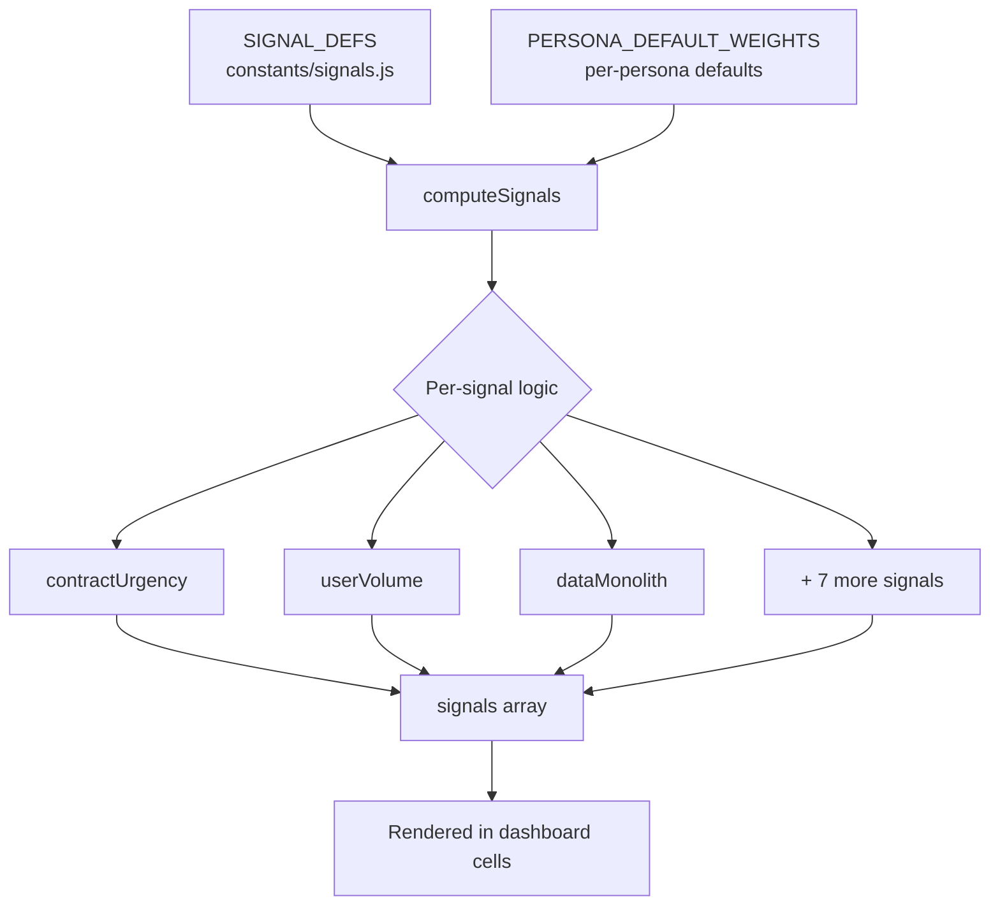

# Signals System

Signals are the core analysis mechanism of the rationalisation engine. They replace hardcoded verdicts with neutral, factual observations about systems in a function row. This page covers how signals are defined, computed, emphasised, and rendered.

## Architecture Overview



The signal pipeline:

1. **Definition** - `SIGNAL_DEFS` array defines the signal vocabulary
2. **Weighting** - `PERSONA_DEFAULT_WEIGHTS` provides per-persona defaults; user can override via Signal Options modal
3. **Computation** - `computeSignals()` evaluates each signal against the systems in a function row
4. **Emphasis** - `computeSignalEmphasis()` adjusts weights based on the rationalisation pattern
5. **Rendering** - Signals are rendered as coloured tags with weight-based visibility

## Signal Definitions

Defined in `src/constants/signals.js`:

```javascript
export const SIGNAL_DEFS = [
    { id: 'contractUrgency', label: 'Contract urgency',
      desc: 'Proximity of the earliest notice period trigger across systems in this function' },
    { id: 'userVolume',      label: 'User volume',
      desc: 'Relative scale of systems by reported user count' },
    { id: 'dataMonolith',    label: 'Monolithic data',
      desc: 'Systems with entangled data structures that would require ETL disaggregation' },
    { id: 'dataPortability', label: 'Data portability',
      desc: 'Ease of bulk data extraction - Low portability indicates vendor lock-in risk' },
    { id: 'vendorDensity',   label: 'Vendor density',
      desc: 'Same vendor present across multiple councils for this function' },
    { id: 'techDebt',        label: 'On-premise systems',
      desc: 'Systems hosted on council servers rather than cloud/SaaS' },
    { id: 'tcopAlignment',   label: 'TCoP alignment',
      desc: 'Assessment against Technology Code of Practice criteria' },
    { id: 'sharedService',   label: 'Shared service',
      desc: 'Systems jointly operated by multiple predecessor councils' },
    { id: 'supportModel',    label: 'Support model',
      desc: 'Sustainability of system maintenance - vendor SLA, community, or unsupported' },
    { id: 'sameVendorConsolidation', label: 'Same-vendor consolidation',
      desc: 'All or most systems from the same vendor - consolidation may be simpler' }
];
```

## Persona Default Weights

Weight levels: 0 = Off, 1 = Low, 2 = Medium, 3 = High. A signal at weight 0 is not computed or displayed.

```javascript
export const PERSONA_DEFAULT_WEIGHTS = {
    executive:  { contractUrgency: 3, userVolume: 2, dataMonolith: 3, dataPortability: 1,
                  vendorDensity: 2, techDebt: 1, tcopAlignment: 1, sharedService: 2,
                  supportModel: 1, sameVendorConsolidation: 2 },
    commercial: { contractUrgency: 3, userVolume: 1, dataMonolith: 1, dataPortability: 0,
                  vendorDensity: 3, techDebt: 0, tcopAlignment: 0, sharedService: 3,
                  supportModel: 1, sameVendorConsolidation: 3 },
    architect:  { contractUrgency: 1, userVolume: 2, dataMonolith: 3, dataPortability: 3,
                  vendorDensity: 1, techDebt: 3, tcopAlignment: 3, sharedService: 1,
                  supportModel: 2, sameVendorConsolidation: 2 }
};
```

Changing persona resets `state.signalWeights` to that persona's defaults. Users can manually override individual weights in the Signal Options modal without changing persona.

## Signal Computation: `computeSignals()`

Location: `src/analysis/signals.js`

```javascript
export function computeSignals(systems, weightsOverride) {
    const weights = weightsOverride || state.signalWeights;
    const signals = [];
    // ... per-signal logic, guarded by weight > 0
    return signals;
}
```

Each signal block follows the same pattern:
1. Check if `weights[signalId] > 0` (skip if Off)
2. Filter/sort the input `systems` array for relevant data
3. Compute the signal value and classify severity
4. Push a signal object to the `signals` array

### Signal Object Shape

```javascript
{
    id: 'contractUrgency',       // Signal ID (matches SIGNAL_DEFS)
    weight: 3,                   // Active weight level
    label: 'Contract urgency',   // Display label
    value: '...',                // Descriptive text (the factual observation)
    tag: 'tag-red',              // CSS class for colour (tag-red|tag-orange|tag-blue|tag-purple|tag-black)
    border: 'border-[#d4351c]', // Optional border class for emphasis
    strong: true                 // Whether this signal is "strong" (drives emphasis rendering)
}
```

## Per-Signal Computation Logic

### contractUrgency

Identifies the system with the most urgent contract notice trigger.

**With vesting date (transition mode):**
- Classifies each system into a vesting zone via `classifyVestingZone(endYear, endMonth, noticePeriod, vestingDate)`
- Zones: `pre-vesting` | `year-1` | `natural-expiry` | `long-tail`
- Sorts by zone priority, then by trigger month within zone
- Reports months before/after vesting and the zone label

| Zone | Tag Colour | Strong? |
|---|---|---|
| pre-vesting | `tag-red` | Yes |
| year-1 | `tag-orange` | Yes |
| natural-expiry | `tag-blue` | No |
| long-tail | `tag-black` | No |

**Without vesting date (discovery mode):**
- Sorts by absolute notice trigger date relative to today
- Classifies by months away: <12 = red, <24 = orange, else blue

### userVolume

Detects the "anchor" system - the dominant system by user count.

```
Anchor ratio = top.users / second.users
If ratio >= 1.5 and top.users > 0: anchor detected (strong signal)
```

- Requires at least 2 systems with `users > 0`
- Reports the largest system's label, user count, and ratio to next largest
- Single-system rows get a neutral "sole system" observation

### dataMonolith

Flags systems where data disaggregation would be complex:

```javascript
const mono = systems.filter(s => s.dataPartitioning === 'Monolithic' || s.isERP);
```

- Always a strong signal (when present)
- Uses `tag-purple` colour
- Lists all matching system labels

### dataPortability

Identifies the worst portability tier present in the function row:

```javascript
const low = systems.filter(s => s.portability === 'Low');
const med = systems.filter(s => s.portability === 'Medium');
const worst = low.length > 0 ? low : med;
```

- Low portability = `tag-red` + strong
- Medium portability = `tag-orange`
- Only fires if at least one system has non-High portability

### vendorDensity

Detects the same vendor across multiple councils:

```javascript
// Groups systems by vendor, checks if any vendor appears from 2+ source councils
```

- Uses `computeVendorDensityMetrics()` for detailed breakdown
- Flags when a vendor serves the same function in multiple predecessor councils
- Relevant for consolidation decisions (familiar vendor = lower migration risk)

### techDebt (On-premise systems)

Uses the hosting helper module (`src/analysis/hosting.js`):

```javascript
import { isNonCloud, getHostingType, detectHostingRisk } from './hosting.js';

// isNonCloud(system) returns true for 'on-premise' or 'partner-hosted'
// getHostingType(system) returns system.hosting or null
```

- Fires when `isNonCloud(system)` is true for any system
- Also detects partner-hosted governance risk via `detectHostingRisk()`
- Partner-hosted systems where the hosting council maps to a different successor get a continuity risk flag

### tcopAlignment

Evaluates systems against Technology Code of Practice points:

```javascript
export function computeTcopAssessment(system) {
    // Returns { alignments: [{point, description}], concerns: [{point, description}] }
}
```

| TCoP Point | Check | Alignment | Concern |
|---|---|---|---|
| Point 5 - Cloud first | `hosting === 'cloud'` | Cloud-hosted | On-premise or partner-hosted |
| Point 4 - Open standards | `portability === 'High'` | High portability | - |
| Points 3, 4, 11 - Vendor lock-in | `portability === 'Low'` | - | Triple concern |
| Point 9 - Modularity | `isERP && Monolithic` | - | Monolithic ERP |

The signal aggregates all concerns across systems in the row, reporting the worst assessment.

### sharedService

Detects shared services and boundary crossings:

```javascript
// Checks system.sharedWith array
// In transition mode: also checks if shared councils map to DIFFERENT successors
// via detectSharedServiceBoundary(system, councilToSuccessorMap)
```

- Cross-boundary shared services (spanning successor boundaries) get `tag-red` + strong
- Same-boundary shared services get a neutral informational tag

### supportModel

Classifies system maintenance sustainability:

```javascript
export function classifySupportModel(system) {
    // Returns { model, isExplicit, summary }
    // model: 'vendor-supported' | 'community-supported' | 'unsupported' | 'unknown'
}
```

- `unsupported` systems get `tag-red` + strong
- `community-supported` gets `tag-orange`
- `vendor-supported` and `unknown` are neutral

### sameVendorConsolidation

Detects when all or most systems are from the same vendor:

```javascript
export function detectSameVendorConsolidation(systems) {
    // Returns null if no pattern, or:
    // { vendor, count, total, isUnanimous, insight }
}
```

- **Unanimous:** All commercial systems from same vendor
- **Supermajority:** 75%+ of commercial systems from same vendor (minimum 4 systems)
- Provides an insight string explaining consolidation implications

## How to Add a New Signal

Step-by-step guide for adding signal #11:

### 1. Define the signal

In `src/constants/signals.js`, add to `SIGNAL_DEFS`:

```javascript
{ id: 'myNewSignal', label: 'My Signal Label', desc: 'What this signal measures' }
```

### 2. Add persona weights

In the same file, add your signal ID to each persona's defaults:

```javascript
executive:  { ..., myNewSignal: 2 },
commercial: { ..., myNewSignal: 1 },
architect:  { ..., myNewSignal: 3 }
```

### 3. Implement the computation

In `src/analysis/signals.js`, add a block in `computeSignals()`:

```javascript
// My new signal
if (weights.myNewSignal > 0) {
    // Filter/analyse the systems array
    const relevant = systems.filter(s => /* your condition */);
    if (relevant.length > 0) {
        signals.push({
            id: 'myNewSignal',
            weight: weights.myNewSignal,
            label: 'My Signal Label',
            value: `${relevant[0].label} - descriptive observation`,
            tag: 'tag-blue',          // Choose: tag-red, tag-orange, tag-blue, tag-purple, tag-black
            border: 'border-[#1d70b8]',
            strong: false             // Set true for critical signals
        });
    }
}
```

### 4. Consider emphasis rules

If your signal should be boosted for certain rationalisation patterns, update `computeSignalEmphasis()`:

```javascript
if (pattern === 'extract-and-partition' || pattern === 'extract-partition-and-consolidate') {
    result.myNewSignal = Math.min((result.myNewSignal || 0) + 1, 3);
}
```

### 5. Write property tests

Create `tests/properties/my-new-signal.property.test.js` using the `arbITSystem` generator.

### 6. Build and verify

```bash
node build.js  # Must pass
npm test       # Existing signal tests must still pass
```

## Signal Emphasis

`computeSignalEmphasis(pattern, weights)` adjusts weights at display time based on the rationalisation pattern:

| Pattern | Boosted Signals (+1, capped at 3) |
|---|---|
| `extract-and-partition` | dataMonolith, dataPortability |
| `extract-partition-and-consolidate` | dataMonolith, dataPortability |
| `choose-and-consolidate` | userVolume, vendorDensity, tcopAlignment, sameVendorConsolidation |
| `inherit-as-is` | No changes |

This means the same system data can produce different signal visibility depending on the classified pattern for that function row.

## Strong Flags

A signal with `strong: true` gets prominent rendering:
- Larger/bolder tag in the signal strip
- May trigger emphasis borders on the function row
- Drives "critical" classification in the estate summary metrics

Strong conditions:
- contractUrgency: pre-vesting or year-1 zone
- userVolume: anchor ratio >= 1.5
- dataMonolith: always strong when present
- dataPortability: Low portability
- sharedService: cross-boundary detection
- supportModel: unsupported system

## Persona-Specific Rendering

Signals with weight 0 (Off) are not computed and never appear in the UI. Higher weights make signals more visually prominent in the matrix cell's signal strip. The combination of persona weights + pattern emphasis creates a focused view:

- **Executive** sees contract urgency, monolithic data, and shared services prominently
- **Commercial** sees vendor density and shared services, with contract urgency
- **Architect** sees technical debt, portability, and TCoP alignment prominently

The rendering logic in `main.js` filters and sorts signals by weight before display, ensuring the most relevant signals for the active persona appear first.
