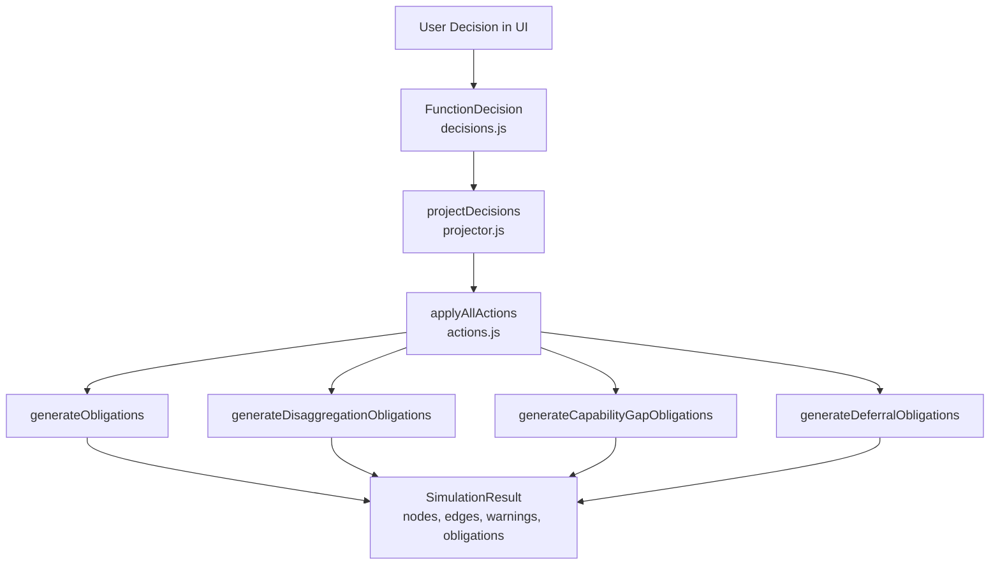
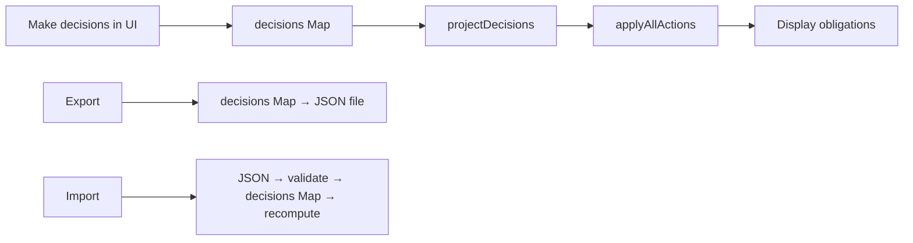

# Simulation Engine

The simulation engine lets users make rationalisation decisions and tracks their consequences. It translates function-level decisions into system-level actions, computes resulting obligations (migrations, governance, capability gaps), and supports save/load/export of decision scenarios.

## Architecture Overview



## Simulation State

When simulation mode is active, `state.simulationState` holds:

```javascript
{
    decisions: Map<string, FunctionDecision>,  // Keyed by getDecisionKey(fnId, successor)
    actions: [],                               // Projected legacy actions
    obligations: [],                           // Generated obligations
    result: { nodes, edges, warnings },        // Post-simulation graph state
    projectorObligations: [],                  // Obligations from projector (deferral costs)
    baselineMetrics: { ... },                  // Snapshot of pre-simulation metrics
}
```

The simulation state is recomputed (`recomputeSimulation()`) every time a decision is added, modified, or removed.

## Decision Model

Location: `src/simulation/decisions.js`

A `FunctionDecision` represents a team's choice for one function in one successor:

```javascript
{
    id: "dec-148-north-essex-1714000000000",
    functionId: "148",                    // ESD taxonomy ID
    successorName: "North Essex Unitary",
    timestamp: "2026-05-22T10:30:00Z",

    // Axis 1: System Choice
    systemChoice: 'choose',              // 'choose' | 'procure' | 'defer'
    retainedSystemIds: ["sys-1"],         // Which systems to keep (choose)
    procuredSystem: null,                 // New system spec (procure)

    // Axis 2: Operating Model Boundary
    boundaryChoice: 'none',              // 'none' | 'disaggregate' | 'maintain-shared' | 'establish-shared'
    disaggregationSplits: [],            // Split definitions (disaggregate)
    sharedWithSuccessors: [],            // Partners (establish-shared)
    sharedServiceOrigin: null,           // Source decision key (propagated decisions)

    // Contract handling
    contractExtensions: []               // Explicit extends for defer
}
```

### Decision Key

```javascript
export function getDecisionKey(functionId, successorName) {
    return `${functionId}::${successorName}`;
}
// Example: '148::North Essex Unitary'
```

### createDecision()

Factory function that generates a well-formed decision with unique ID and timestamp:

```javascript
export function createDecision({
    functionId, successorName, systemChoice,
    retainedSystemIds, procuredSystem,
    boundaryChoice, disaggregationSplits,
    sharedWithSuccessors, sharedServiceOrigin,
    contractExtensions
}) { ... }
```

## Action Types

Location: `src/simulation/actions.js`

The legacy action system is a discriminated union on the `type` field. The projector converts decisions into these actions:

| Action Type | Purpose | Key Fields |
|---|---|---|
| `consolidate` | Choose a system, decommission others | `functionId`, `successorName`, `targetSystemId`, `removeSystemIds` |
| `consolidate-erp` | ERP consolidation across functions | `successorName`, `targetSystemId`, `affectedFunctionIds` |
| `decommission` | Remove a system entirely | `systemId` |
| `extend-contract` | Extend a system's contract end date | `systemId`, `newEndYear`, `newEndMonth` |
| `migrate-users` | Transfer users between systems | `fromSystemId`, `toSystemId`, `userCount` |
| `split-shared-service` | Split a shared service into successor-scoped instances | `systemId`, `splits[]` |
| `disaggregate` | Partition a system across successors | `systemId`, `splits[]` |
| `procure-replacement` | Replace a system with a new procurement | `functionId`, `successorName`, `newSystem`, `replacesSystemId` |
| `establish-shared-service` | Designate a system as shared across successors | `systemId`, `functionId`, `sharedSuccessorFunctionNodeIds` |

## How Actions Modify State

`applyAllActions(baselineNodes, baselineEdges, actions, baselineAllocation, lgaFunctionMap)`:

1. Deep-copies the baseline nodes and edges (never mutates the original)
2. Applies each action sequentially
3. For each action, tracks removed node IDs
4. Generates obligations for removed systems
5. Checks for capability systems among removed nodes and generates capability-gap obligations
6. Returns a `SimulationResult`:

```javascript
{
    nodes: [...],          // Modified node array
    edges: [...],          // Modified edge array
    warnings: [...],       // Human-readable warning strings
    obligations: [...],    // Generated obligation records
    appliedCount: number   // Number of successfully applied actions
}
```

### Consolidate action example

```javascript
// When action.type === 'consolidate':
// 1. Find the target system node (the one to keep)
// 2. Find systems to remove (removeSystemIds)
// 3. For ERP systems retained elsewhere: sever REALIZES edge only (severOnly field)
// 4. Remove non-retained system nodes
// 5. Remove orphaned REALIZES edges
```

### Retained-system guard

The projector builds a global set of all retained system IDs across ALL decisions before projecting any single decision. A system retained by Decision A cannot be decommissioned as a side-effect of Decision B.

## The Projector

Location: `src/simulation/projector.js`

`projectDecisions()` bridges the decision model to the action engine:

```javascript
export function projectDecisions(decisions, baselineNodes, baselineEdges, baselineAllocation, lgaFunctionMap) {
    // Returns { actions: Array, obligations: Array }
}
```

### Projection Rules

| Decision systemChoice | Resulting Actions |
|---|---|
| `choose` | `consolidate` (with optional `disaggregate` first if boundaryChoice is 'disaggregate') |
| `procure` | `procure-replacement` |
| `defer` | `extend-contract` for expiring systems + deferral-cost obligations |

### Ordering

Actions are ordered for deterministic application:

1. **Priority 0:** Disaggregate/boundary decisions (create new node IDs first)
2. **Priority 1:** Choose/procure decisions (reference existing or newly-created nodes)
3. **Priority 2:** Defer decisions (extend contracts last)

### ERP Sever-Only

When a `choose` decision removes a system that is retained by another decision (i.e., it serves other functions via other REALIZES edges), the system's edge to the current function is severed but the node is preserved. This prevents ERP systems from being incorrectly deleted when they still serve other function rows.

## Obligation Generation

Location: `src/simulation/obligations.js`

When actions remove systems, obligations track what must happen for the transition to remain viable.

### Obligation Types

| Type | When Generated | What It Tracks |
|---|---|---|
| `data-migration` | System removed, target system exists | Data must move from old to new system |
| `function-gap` | System removed, no target exists | Function has no serving system |
| `cross-successor-impact` | System served another successor too | Spillover effect to other successors |
| `data-partition` | Disaggregate action | Splitting data across successor instances |
| `deferral-cost` | Defer decision | Cost of running parallel systems |
| `shared-service-governance` | Shared service establishment | Governance framework needed |
| `capability-gap` | Capability provider removed | Consumer systems lose a dependency |

### SimulationObligation Shape

```javascript
{
    id: "obl-0-sys-1-North Essex-148",
    type: 'data-migration',
    actionIndex: 0,
    actionType: 'consolidate',
    fromSystem: {
        id, label, council, vendor, users, annualCost,
        dataPartitioning, portability, isERP, hosting,
        endYear, endMonth, noticePeriod
    },
    toSystem: { id, label, council } | null,
    affectedSuccessors: ["North Essex Unitary"],
    functionId: "148",
    functionLabel: "Adult Social Care",
    isMonolithic: false,
    isLowPortability: false,
    isERP: false,
    isOnPrem: false,
    userCount: 3500,
    annualCost: 950000,
    contractEndDate: "2028-03",
    noticePeriod: 12,
    resolved: true              // true if target system absorbs the obligation
}
```

### Cross-Successor Impact

When a system serves Function F in Successor A AND Successor B, and Successor A decides to decommission it, an obligation with `type: 'cross-successor-impact'` is created for Successor B. This surfaces invisible spillover effects.

### Capability Gap Detection

When a removed system has `capabilityType` (it's a capability provider), the engine checks for CONSUMES_CAPABILITY edges pointing to it and generates capability-gap obligations for each dependent consumer system.

### Deferral Cost Obligations

Generated by the projector (not the action engine) when `systemChoice === 'defer'`:

```javascript
{
    type: 'deferral-cost',
    parallelSystems: [...],              // Systems running in parallel during deferral
    combinedAnnualCost: 450000,          // Total cost of parallel running
    contractExtensionsNeeded: [...]      // Systems needing contract extensions
}
```

## Impact Calculation

Obligation severity is computed at **render time** using the active persona's signal weights. The same obligation can appear as high-severity for an architect (who weights portability highly) but low-severity for an executive (who weights contract urgency).

Severity factors:
- `isMonolithic` - high severity for data-related obligations
- `isLowPortability` - high severity for migration obligations
- `isERP` - always high complexity
- `isOnPrem` - adds infrastructure migration overhead
- `userCount` - scale of user disruption
- `annualCost` - financial impact

## Scenario Save/Load/Export

Location: `src/features/scenario-manager.js`

### Export

```javascript
export function exportScenario() {
    // Serialises state.simulationState.decisions Map to JSON
    // Obligations are NOT saved - they are reconstructed on import
}
```

The export format:

```json
{
    "version": 1,
    "exported": "2026-05-22T10:30:00Z",
    "decisions": [
        { "id": "dec-148-...", "functionId": "148", "successorName": "...", ... }
    ]
}
```

### Import

```javascript
export function importScenario(json) {
    // Validates the JSON structure
    // Rebuilds the decisions Map
    // Triggers recomputeSimulation() to regenerate actions + obligations
}
```

Obligations are always regenerated from the current baseline data, not stored. This ensures that if the architecture data has changed since export, obligations reflect the current state.

### Scenario Lifecycle



## How to Add a New Action Type

1. Define the action shape in the JSDoc at the top of `src/simulation/actions.js`
2. Add handling in `applyAction()` (the single-action dispatcher):
   ```javascript
   case 'my-new-action':
       // Modify nodes/edges as needed
       break;
   ```
3. If it removes systems, obligation generation happens automatically via `getRemovedSystemIds()`
4. If it needs custom obligations, add a generator in `obligations.js`
5. Add projection logic in `projector.js` if it should be produced from a decision
6. Write property tests in `tests/properties/simulation-actions.property.test.js`

## How to Add a New Obligation Type

1. Add the type string to the `SimulationObligation` type union in `obligations.js`
2. Create a generator function:
   ```javascript
   export function generateMyNewObligation(system, action, actionIndex, ...) {
       return [{
           id: `obl-${actionIndex}-mynew-${system.id}`,
           type: 'my-new-type',
           // ... populate all standard fields
       }];
   }
   ```
3. Call it from `applyAllActions()` at the appropriate point
4. Add rendering support in `simulation-panel.js` for the new obligation type
